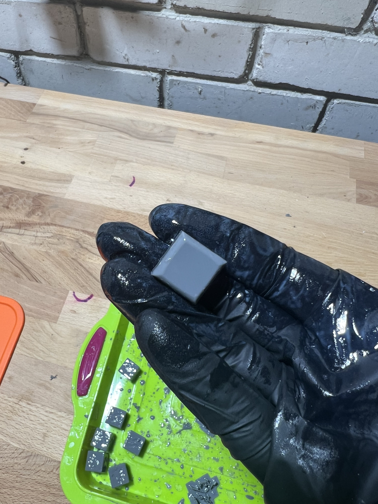

# Juku keycap

A keycap for the Juku keyboard, modeled in OpenSCAD: dished top, rounded
chamfered sides, a central spring rod, contact pushers and side latches
that clip into the switch housing.

The model lives in `juku_keycap.scad`; everything else (STL, images) is
generated from it. Technical details are in [NOTES.md](NOTES.md).

> [!NOTE]
> This project is an experiment: can an LLM fully create a 3D model of
> medium complexity? Turns out it can. All the code was written by an LLM
> (mostly GPT-5.5 via Codex) with no manual edits.

|  | Top | Bottom |
| --- | --- | --- |
| Render |  |  |
| Print |  |  |
