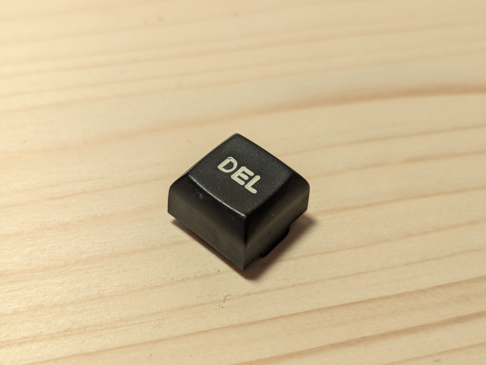
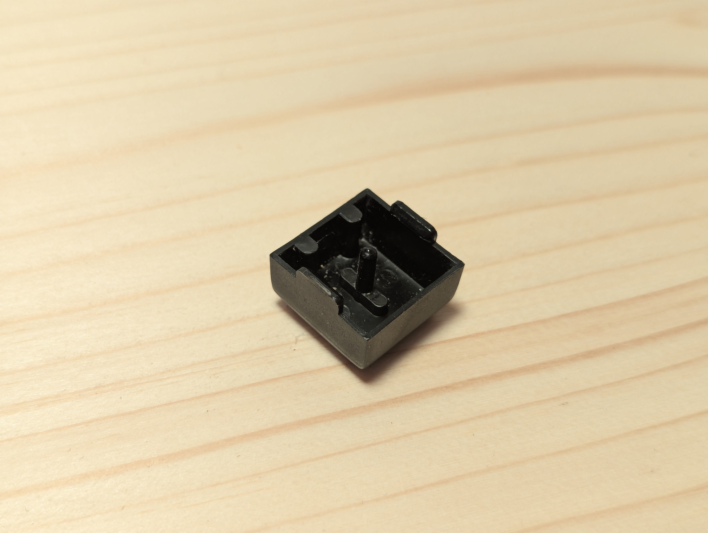
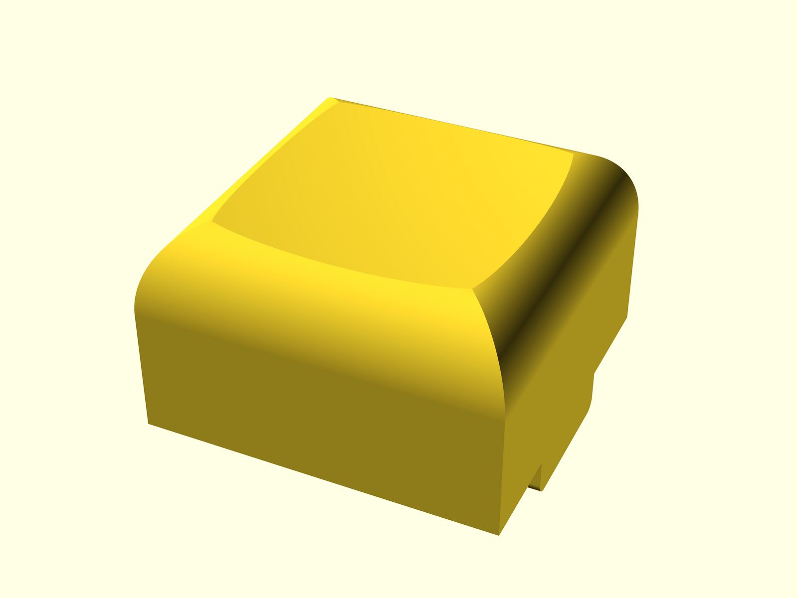
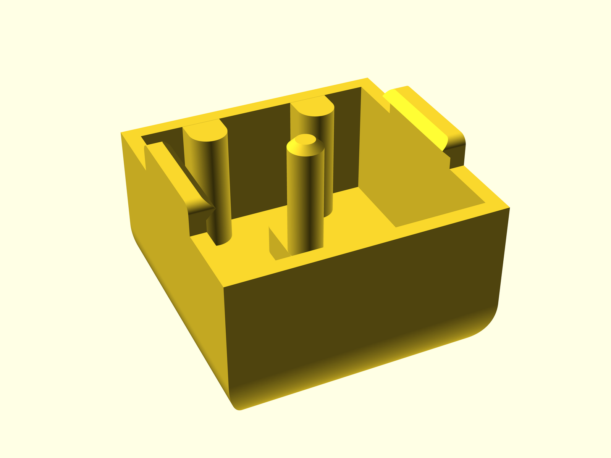
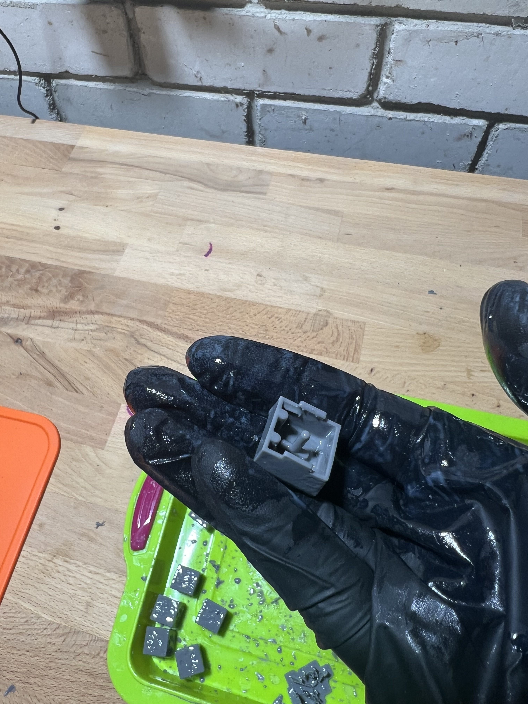
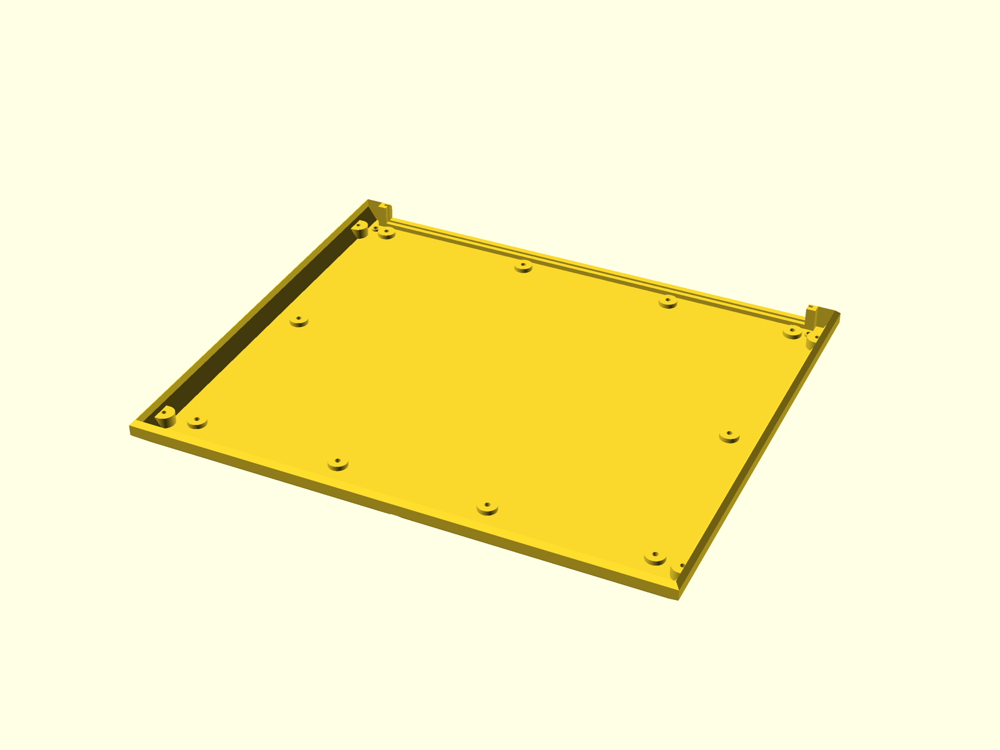
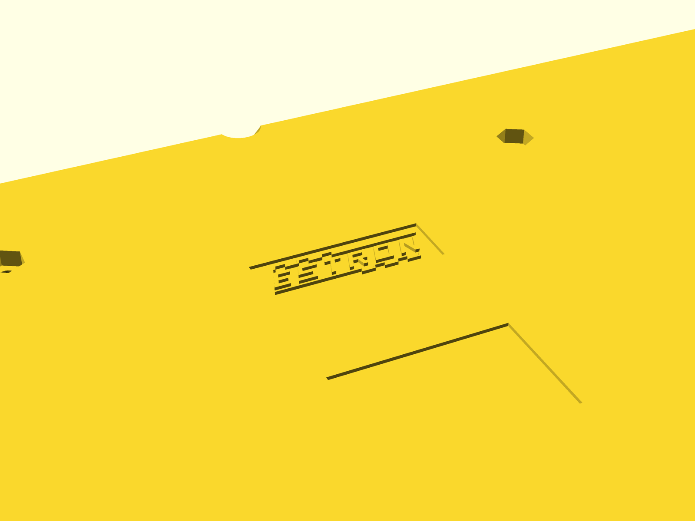

# Juku models

OpenSCAD models for restoring and reproducing parts of the Juku computer.
Technical dimensions and modeling details are in [NOTES.md](NOTES.md).

> [!NOTE]
> This project is an experiment in creating medium-complexity 3D models
> with an LLM. The OpenSCAD code was written through Codex with almost no
> manual code edits.

## Models

### Keycap

The keycap has a dished top, rounded chamfered sides, a central spring rod,
contact pushers, and side latches that clip into the switch housing.

|  | Top | Bottom |
| --- | --- | --- |
| Original |  |  |
| Render |  |  |
| Print |  |  |

- Source: [`keycap/juku-keycap.scad`](keycap/juku-keycap.scad)
- Printable model: [`keycap/juku-keycap.stl`](keycap/juku-keycap.stl)

### Bottom Case

The bottom part of the computer case includes the PCB opening and guide,
leg mounting holes, and reinforced PCB support mounts.

| Interior | Underside (logo) | Rear edge (supports) |
| --- | --- | --- |
|  |  |  |

- Source: [`bottom-case/juku-bottom-case.scad`](bottom-case/juku-bottom-case.scad)
- Printable model: [`bottom-case/juku-bottom-case.stl`](bottom-case/juku-bottom-case.stl)

## Commands

```bash
# Open a model for interactive inspection.
./scripts/open-keycap.sh
./scripts/open-bottom-case.sh

# Validate both models without changing committed artifacts.
./scripts/check-render.sh

# Regenerate committed STL files and previews.
./scripts/export-stls.sh
./scripts/render-previews.sh

# Export the bottom-case XY projection for LibreCAD.
openscad-nightly \
    -o bottom-case/projection-xy.dxf \
    bottom-case/projection-xy.scad
```
