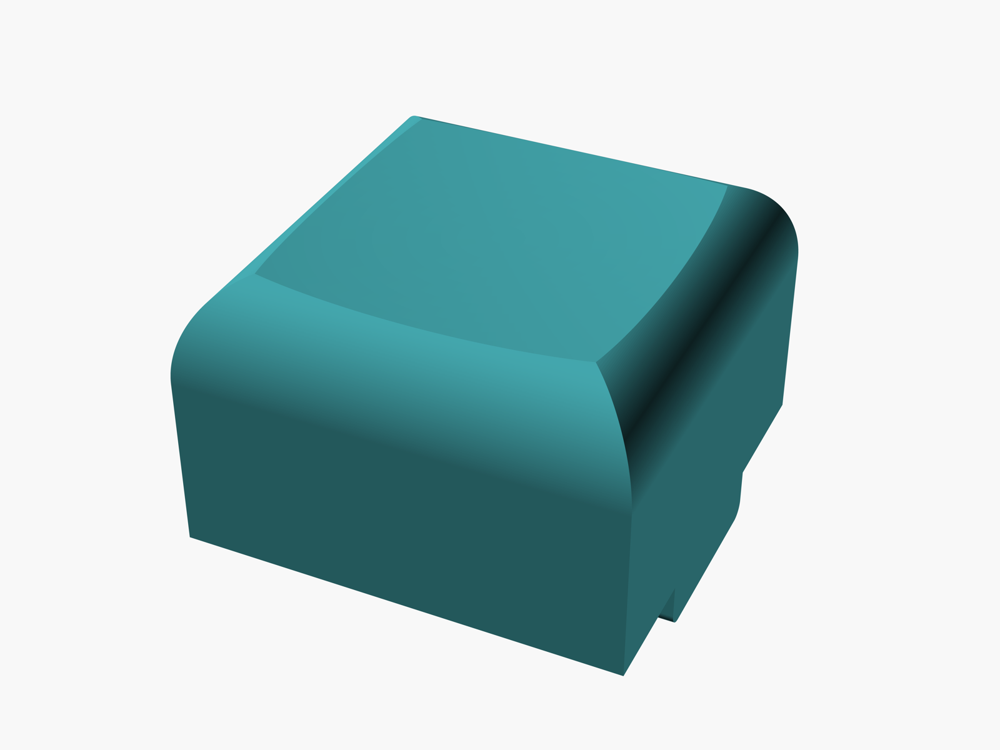
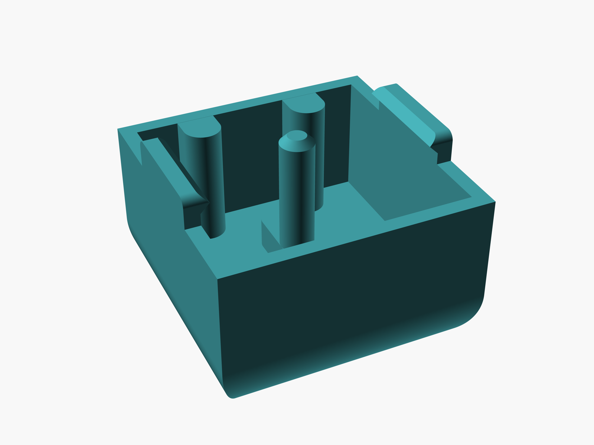

# Juku keycap

Parametric OpenSCAD model of a keycap for the Juku keyboard: dished top,
rounded chamfered sides, a central spring rod, contact pushers and side
latches that clip into the switch housing.

> **`juku_keycap.scad` is the only source file.** The STL and the preview
> images are generated from it — do not edit them by hand, regenerate them
> instead (see below).

## Previews

*Generated from `juku_keycap.scad` by `scripts/render-previews.sh`.*

| Top | Bottom |
| --- | --- |
|  |  |

## Files

| File | Role |
| --- | --- |
| `juku_keycap.scad` | **Source.** The model itself |
| `juku_keycap.stl` | Generated. Mesh export for printing |
| `preview_top.png`, `preview_bottom.png` | Generated. Rendered previews |

## Regenerating

```bash
# STL (use `openscad-nightly` on Linux, see NOTES.md)
openscad -o juku_keycap.stl juku_keycap.scad

# Preview images
./scripts/render-previews.sh
```

See [NOTES.md](NOTES.md) for the modeling workflow and OpenSCAD tips.
