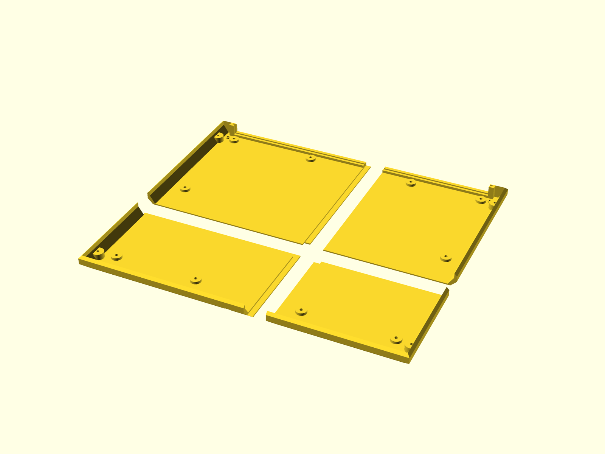
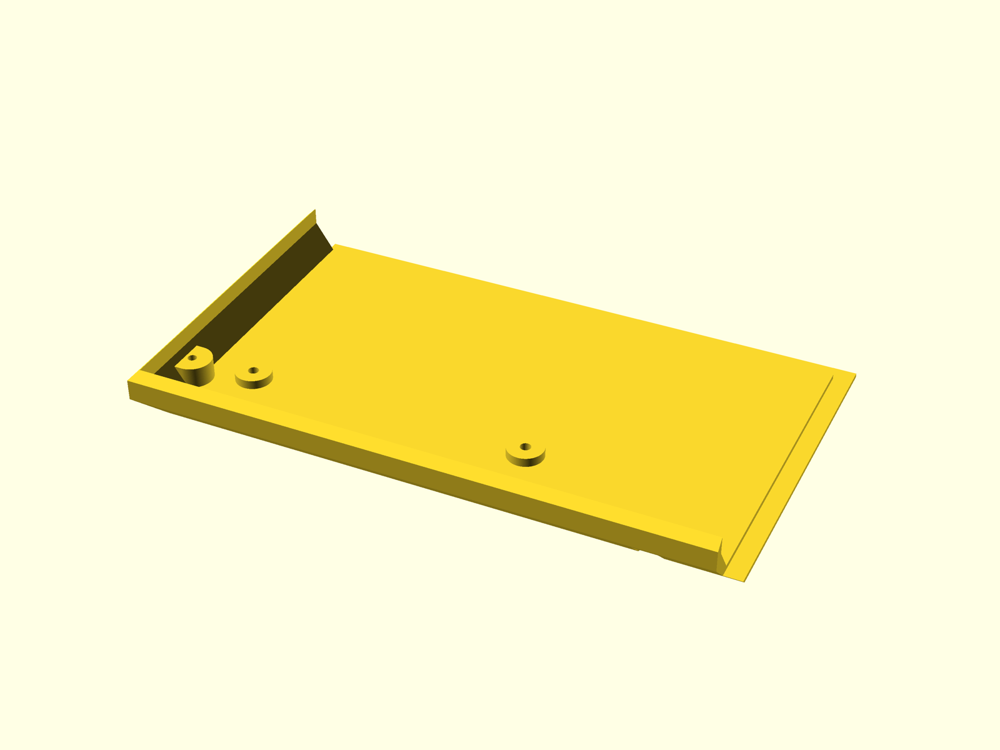
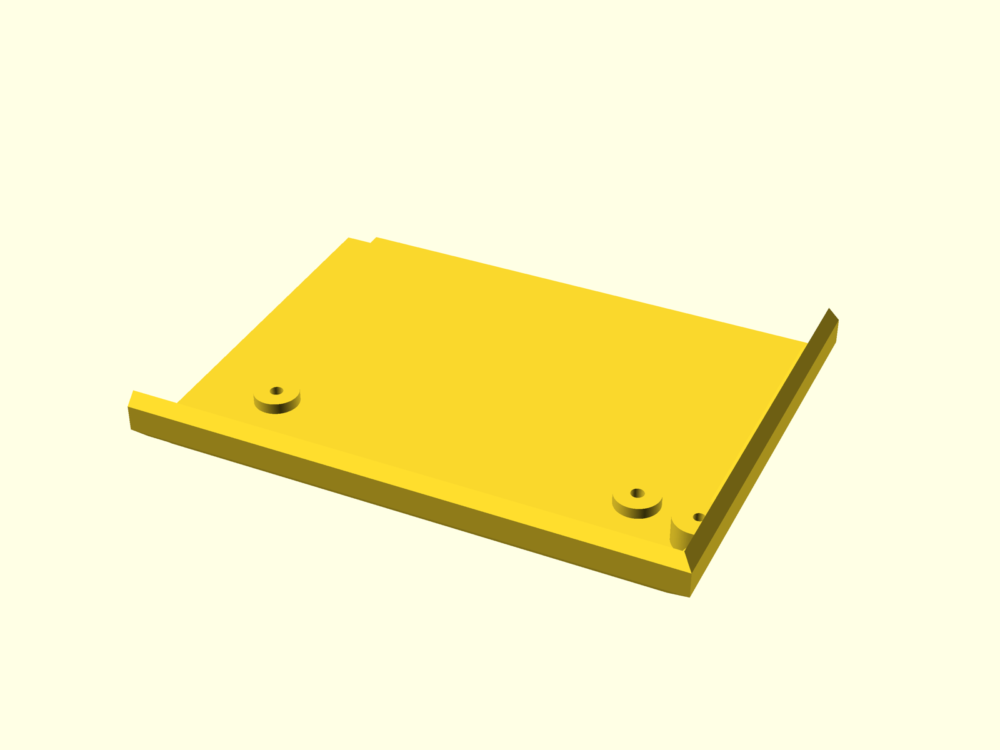
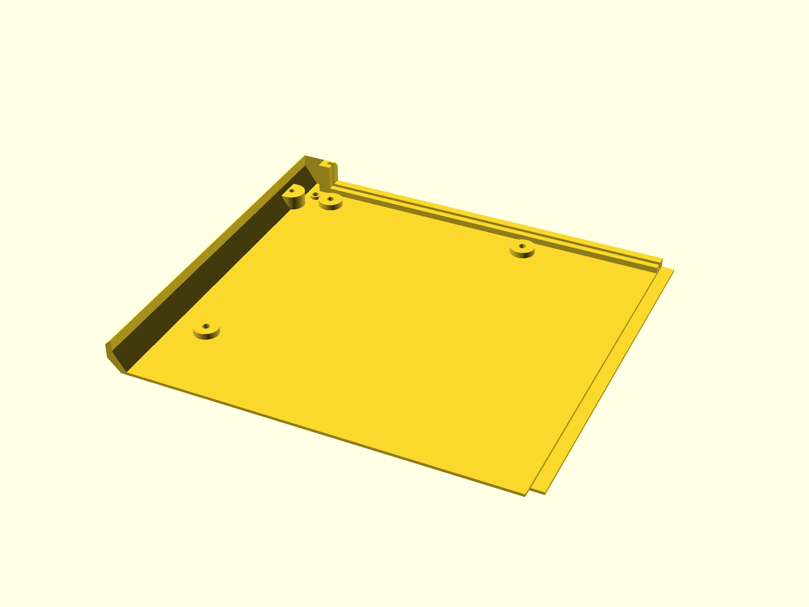
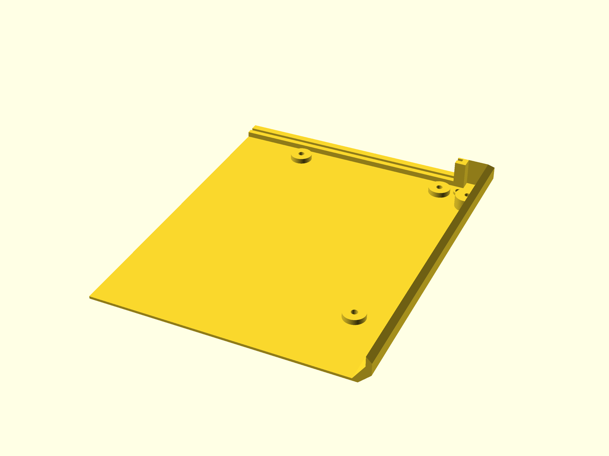

# Bottom case — 4-part split for small print beds

The assembled bottom case is **340 × 290 mm**. That does not fit a common
**256 × 256 mm** bed, so `juku-bottom-case-split.scad` cuts it into a 2×2 grid
of quadrants joined by half-lap seams, glued back together.

> **You only need this if your bed is too small.** The one-piece
> `juku-bottom-case.scad` is the canonical model and is left completely
> untouched. With a printer of ~300 mm or wider, print that file and ignore the
> split entirely.



## Why four pieces (and not two or three)

A piece fits the bed if its long side ≤ 256, or — laid diagonally — if
`long + short ≲ 256·√2 ≈ 362`.

- **2 pieces** can't work: both case dimensions (340 and 290) exceed 256, so any
  single straight cut leaves one piece over the limit on the other axis.
- **3 pieces** can't work either: three equal strips need a 285 mm square (cut
  the 340 side) or a 309 mm square (cut the 290 side) — both over 256. Any valid
  3-rectangle partition is a guillotine cut, and every option leaves one piece
  over 256 on both sides.
- **4 pieces** (2×2) is the true minimum. Each quadrant fits flat with margin —
  no diagonal tricks needed.

## How the model is built

`juku-bottom-case-split.scad` does **not** redefine the case. It pulls in the
original with `use <juku-bottom-case.scad>`, then intersects it with two
half-lap selectors (one per seam) to carve out each quadrant.

### Cut planes

| Plane | Value | Clears |
|-------|-------|--------|
| `split_x` | **195** | centred logo/serial recesses (155–185), front-centre lid boss (170), PCB-support bosses |
| `split_y` | **115** | PCB-support rows (32 / 152 / 272), lid-mount bosses (25 / 265) |

Resulting quadrants — nominal size plus the half-lap shelf each laps past the
seam (`+ lap_width/2`), all ≤ 256:

| Quadrant | Width × Depth (incl. lap) | STL | Preview |
|----------|---------------------------|-----|---------|
| `fl` front-left  | 198 × 118 | [`juku-bottom-case-fl.stl`](juku-bottom-case-fl.stl) |  |
| `fr` front-right | 148 × 118 | [`juku-bottom-case-fr.stl`](juku-bottom-case-fr.stl) |  |
| `bl` back-left   | 198 × 178 | [`juku-bottom-case-bl.stl`](juku-bottom-case-bl.stl) |  |
| `br` back-right  | 148 × 178 | [`juku-bottom-case-br.stl`](juku-bottom-case-br.stl) |  |

### Half-lap seams

Each seam is a **half-lap worked into the 3 mm floor thickness** rather than a
flat butt joint. The cut steps in Z partway through the floor and offsets
sideways, so one piece carries the top shelf past the seam and the other the
bottom shelf; the shelves overlap, locate each other in Z, and are glued.

```
cross-section across a seam (3 mm thick):
    LEFT  ###########
          ###########            <- top shelf (left)
          ------=========        <- step at lap_step
                =========        <- bottom shelf (right)  RIGHT
          |<- lap_width ->|
```

- Because the step lives **inside the floor**, the taller perimeter walls are
  simply cut straight (a butt joint) — no thin features weakening them.
- Defaults: `lap_width = 6 mm` (shelf overlap), `lap_step = 1.5 mm` (even
  halves; set `1.0` for a thinner bottom shelf).
- `split_kerf = 0.2 mm` is removed from every mating face as a slip-fit / glue
  gap.

The lapped shelves handle Z-alignment; glue across the overlap carries the load.

## Rendering & exporting

The four quadrant STLs and previews are committed alongside this file and are
regenerated by the repo scripts:

```bash
scripts/export-stls.sh       # writes juku-bottom-case-{fl,fr,bl,br}.stl
scripts/render-previews.sh   # writes preview-split.png + preview-split-*.png
```

To work with a single quadrant by hand — preview all four exploded apart
(default), or export one (`fl` / `fr` / `bl` / `br`):

```bash
osc=/Applications/OpenSCAD.app/Contents/MacOS/OpenSCAD   # or: openscad-nightly
"$osc" juku-bottom-case-split.scad                       # exploded preview
"$osc" -o fl.stl --export-format binstl --backend Manifold \
    -D 'split_part="fl"' juku-bottom-case-split.scad
```

The console echoes each quadrant footprint and the build asserts every piece
fits `bed_size` (default 256) — bump `bed_size` if your printer is larger and
you still want a (coarser) split.

## Assembly

1. Print all four quadrants flat (floor down).
2. Dry-fit: slide the lapped shelves together and confirm they close flush and
   the floor sits coplanar. Adjust `split_kerf` if the fit is too tight/loose.
3. Glue the lapped shelves (cyanoacrylate, or solvent/epoxy) and clamp until set.
4. The lap handles alignment; the glued overlap carries the load.

## Tuning

All knobs live at the top of `juku-bottom-case-split.scad`: `split_x`,
`split_y`, `split_kerf`, `bed_size`, `lap_width` and `lap_step`. If you change a
case dimension in `juku-bottom-case.scad`, update the mirrored constants near
the top of the split file (they are flagged with a comment).
