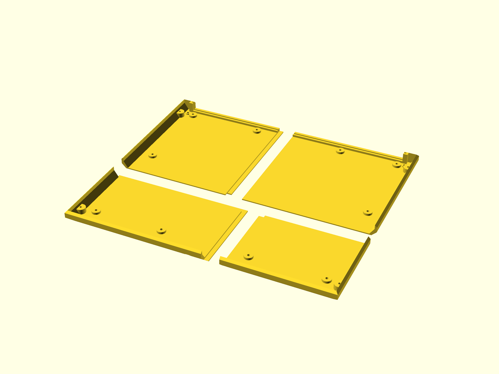
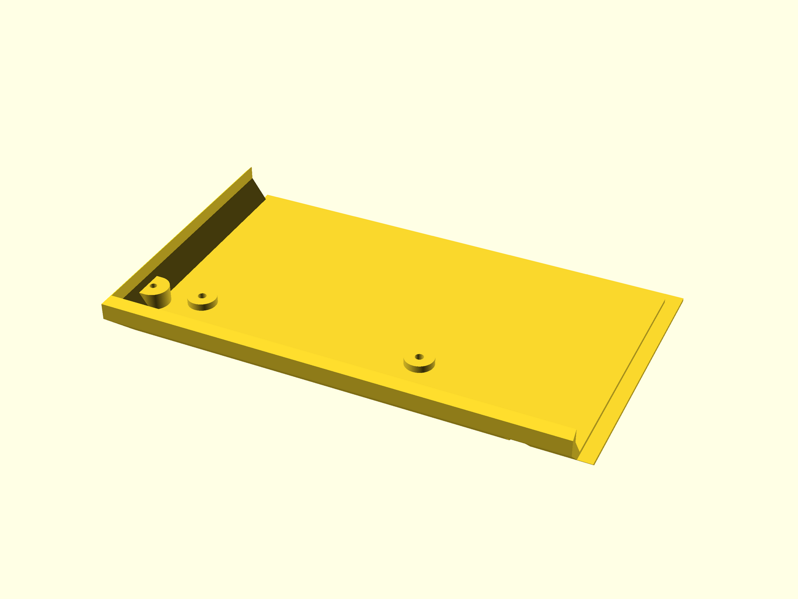
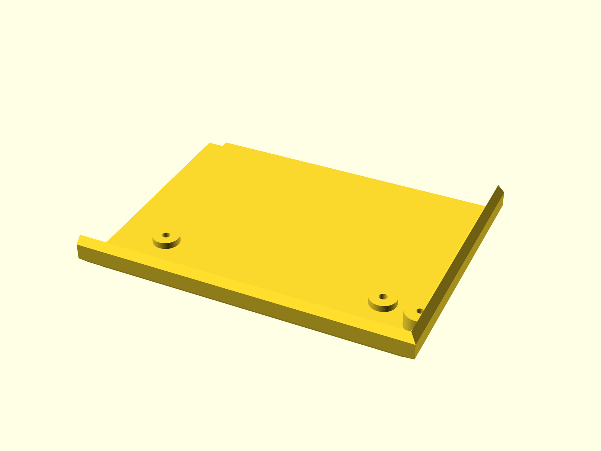
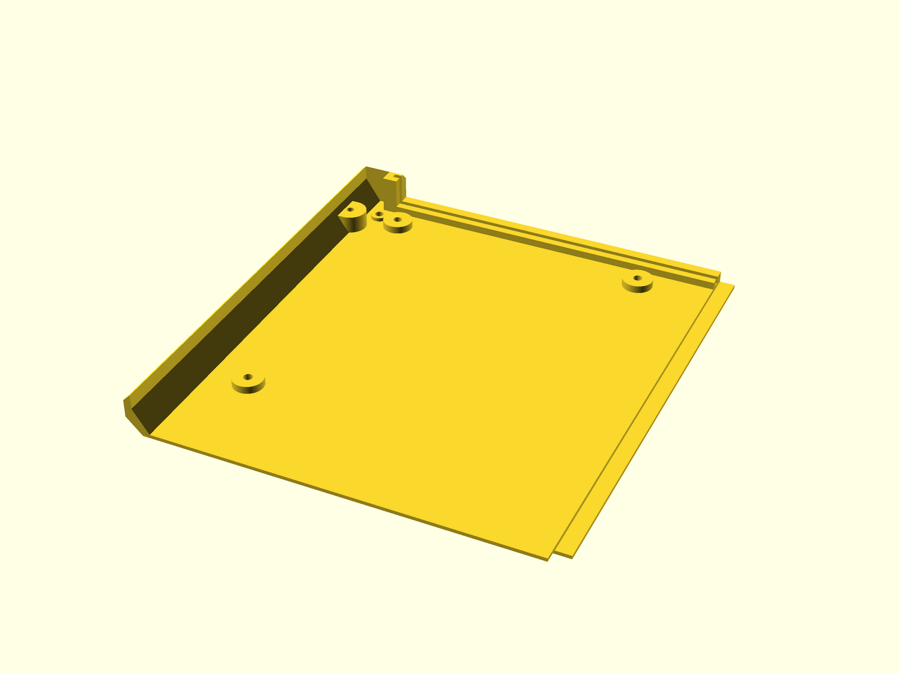
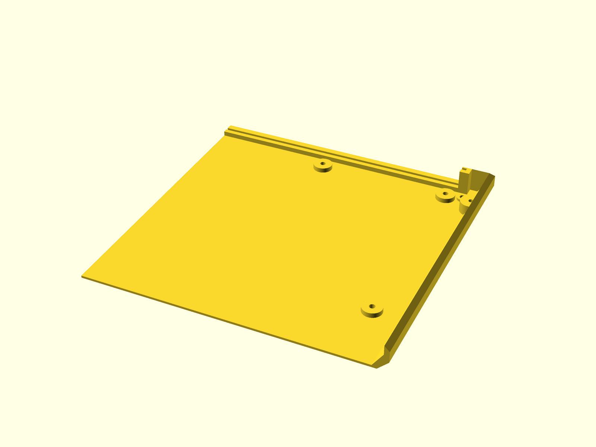

# Bottom case — staggered 4-part split for small print beds

The assembled bottom case is **340 × 290 mm**. That does not fit a common
**256 × 256 mm** bed, so `juku-bottom-case-split.scad` cuts it into four panels
joined by half-lap seams and glued back together. The front and rear vertical
seams are offset, producing two T-junctions rather than one four-way crossing.

> **You only need this if your bed is too small.** The one-piece
> `juku-bottom-case.scad` is the canonical model and is left completely
> untouched. With a printer of ~300 mm or wider, print that file and ignore the
> split entirely.



## Why four pieces

A piece fits the bed if its long side ≤ 256, or — laid diagonally — if
`long + short ≲ 256·√2 ≈ 362`.

For axis-aligned rectangular partitions, two or three pieces leave at least one
part too large for a 256 mm bed. Four pieces fit flat with comfortable margin,
without diagonal placement or unusual slicer setup. More elaborate irregular
partitions may exist, but saving one print is not worth their harder seam
routing and assembly.

The obvious four-piece layout is a 2×2 grid. This model instead staggers the X
seam by 35 mm between the front and rear regions. Removing the four-way crossing
has three practical benefits:

- front and rear pairs can be glued and clamped independently;
- their completed halves are then joined across the Y seam;
- no continuous X seam runs through the full depth of the case.

## How the model is built

`juku-bottom-case-split.scad` does **not** redefine the case. It pulls in the
original with `use <juku-bottom-case.scad>`, then intersects it with two
half-lap selectors (one per seam) to carve out each panel.

### Cut planes

| Plane | Value | Clears |
|-------|-------|--------|
| `split_x_front` | **195** | centred logo/serial recesses (155–185), front-centre lid boss (170), front PCB-support bosses |
| `split_x_rear` | **160** | rear PCB-support bosses; staggers the X seam by 35 mm |
| `split_y` | **115** | PCB-support rows (32 / 152 / 272), lid-mount bosses (25 / 265) |

Resulting panels — nominal size plus the half-lap shelf each laps past the
seam (`+ lap_width/2`), all ≤ 256:

| Panel | Width × Depth (incl. lap) | STL | Preview |
|----------|---------------------------|-----|---------|
| `fl` front-left  | 198 × 118 | [`juku-bottom-case-fl.stl`](juku-bottom-case-fl.stl) |  |
| `fr` front-right | 148 × 118 | [`juku-bottom-case-fr.stl`](juku-bottom-case-fr.stl) |  |
| `bl` back-left   | 163 × 178 | [`juku-bottom-case-bl.stl`](juku-bottom-case-bl.stl) |  |
| `br` back-right  | 183 × 178 | [`juku-bottom-case-br.stl`](juku-bottom-case-br.stl) |  |

### Half-lap seams

Each seam is a **half-lap worked into the 3 mm floor thickness** rather than a
flat butt joint. The cut steps in Z partway through the floor and offsets
sideways, so one piece carries the top shelf past the seam and the other the
bottom shelf; the shelves overlap, locate each other in Z, and are glued.

```
cross-section across a seam (3 mm thick):
    LEFT  ###########
          ###########            <- top shelf (left)
          ------=========        <- step at lap_step
                =========        <- bottom shelf (right)  RIGHT
          |<- lap_width ->|
```

- Because the step lives **inside the floor**, the taller perimeter walls are
  simply cut straight (a butt joint) — no thin features weakening them.
- Defaults: `lap_width = 6 mm` (shelf overlap), `lap_step = 1.5 mm` (even
  halves; set `1.0` for a thinner bottom shelf).
- `split_kerf = 0.2 mm` is removed from every mating face as a slip-fit / glue
  gap.

The lapped shelves handle Z-alignment; glue across the overlap carries the load.

## Rendering & exporting

The four panel STLs and previews are committed alongside this file and are
regenerated by the repo scripts:

```bash
scripts/export-stls.sh       # writes juku-bottom-case-{fl,fr,bl,br}.stl
scripts/render-previews.sh   # writes preview-split.png + preview-split-*.png
```

To work with a single panel by hand — preview all four exploded apart
(default), or export one (`fl` / `fr` / `bl` / `br`):

```bash
osc=/Applications/OpenSCAD.app/Contents/MacOS/OpenSCAD   # or: openscad-nightly
"$osc" juku-bottom-case-split.scad                       # exploded preview
"$osc" -o fl.stl --export-format binstl --backend Manifold \
    -D 'split_part="fl"' juku-bottom-case-split.scad
```

The console echoes each panel footprint and the build asserts every piece
fits `bed_size` (default 256) — bump `bed_size` if your printer is larger and
you still want a (coarser) split.

## Assembly

1. Print all four panels flat (floor down).
2. Dry-fit: slide the lapped shelves together and confirm they close flush and
   the floor sits coplanar. Adjust `split_kerf` if the fit is too tight/loose.
3. Glue the front pair (`fl` + `fr`) and rear pair (`bl` + `br`) separately,
   clamping each pair until set.
4. Glue the two completed halves across the Y seam and clamp until set.
5. The lap handles Z alignment; the glued overlap carries the load.

## Tuning

All knobs live at the top of `juku-bottom-case-split.scad`: `split_x_front`,
`split_x_rear`, `split_y`, `split_kerf`, `bed_size`, `lap_width` and
`lap_step`. If you change a case dimension in `juku-bottom-case.scad`, update
the mirrored constants near the top of the split file (they are flagged with a
comment).
