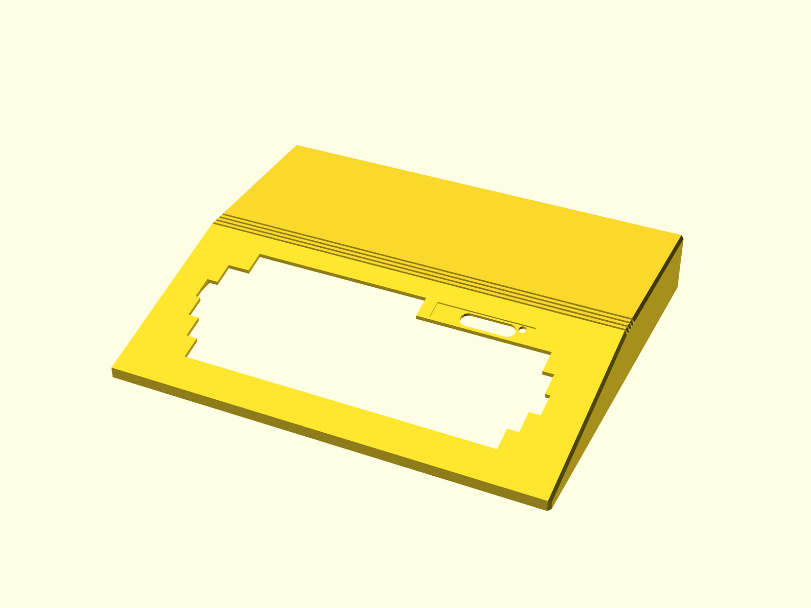

# Juku Top Case

OpenSCAD model for the top half of the Juku computer case.



## Files

- Source: [`juku-top-case.scad`](juku-top-case.scad)
- Printable/reference model: [`juku-top-case.stl`](juku-top-case.stl)
- Preview render: [`preview.png`](preview.png)

## Current Model

The top case is an open-bottom shell with a sloped keyboard face, keyboard
opening, side-wall chamfers, rear ventilation slots, a recessed logo area, LED
hole, and rounded config-switch access opening.

The main dimensions and feature offsets are named near the top of
`juku-top-case.scad`. Keep changes parameterized there where practical.

## Regeneration

From the repository root:

```bash
./scripts/export-stls.sh
./scripts/render-previews.sh
```
